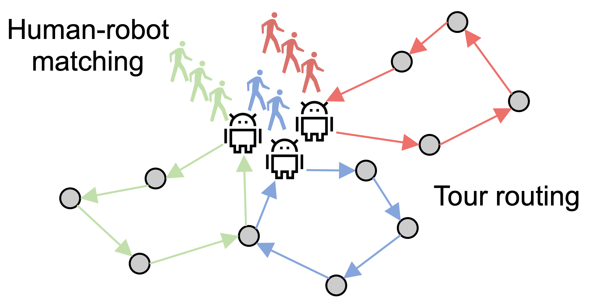

# Multi-robot tour guide: <br/> a simultaneous matching and routing problem
This repository **simultaneously** solves a bipartite **matching** and vehicle **routing** **problem** to match human with the correct robot and meanwhile generate the robot tours.

The goal is to maximize the satisfied human requests (some places of interest to visit) with the generated human-robot matching and robot routes under traveling and visiting time uncertainty.

Practical constraints like time limits are considered.



## Install the dependencies
```bash
pip3 install gurobipy
pip3 install ortools
pip3 install networkx
```

## Run an example
Run the following command and find the figures in the `temp` folder.
```bash
mkdir temp
python3 example_main.py
```

## Run a simulation

To run the simulation shown below where three robots guides multiple humans in an indoor environment. Refer to the repository https://github.com/UMich-CURLY/habitat_multi_docker.


## References
B. Fu, T. Kathuria, D. Rizzo, M. Castanier, X. J. Yang, M. Ghaffari, and K. Barton, “Simultaneous human-robot matching and routing for multi-robot tour guiding under time uncertainty,” Journal of Autonomous Vehicles and Systems, pp. 1–12, 2022. \[[Publisher](https://doi.org/10.1115/1.4053428)\] \[[Video](https://youtu.be/jx1RtK0g6fo)\]
